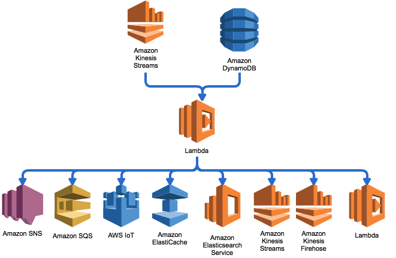

# aws-lambda-fanout

This function answers a need I have had multiple times, where I want to replicate data from an Amazon Kinesis Stream to another account or another region for processing, or to another environment such as development.

This AWS Lambda function can be used to propagate incoming messages from Amazon Kinesis Streams or Amazon DynamoDB Streams to other services ([Amazon SNS](https://aws.amazon.com/sns/), [Amazon SQS](https://aws.amazon.com/sqs/), [Amazon Elasticsearch Service](https://aws.amazon.com/elasticsearch-service/), [Amazon Kinesis Streams](https://aws.amazon.com/kinesis/streams/), [Amazon Kinesis Firehose](https://aws.amazon.com/kinesis/firehose/), [AWS IoT](https://aws.amazon.com/iot/), [AWS Lambda](https://aws.amazon.com/lambda/), [Amazon ElastiCache for Memcached and Redis](https://aws.amazon.com/elasticache/)), regions or accounts. This function generates metrics that will be published to Amazon CloudWatch Metrics, in the `Custom/FanOut` namespace.

This function can be run in the 'public' AWS Lambda mode (and should be the default for most services), or inside an Amazon Virtual Private Cloud (VPC) if you use Amazon ElastiCache (Redis or memcached).

As the configuration data resides in Amazon DynamoDB, and because the function sends metrics via Amazon CloudWatch, the function **must** have Internet access. To have Internet access, an [AWS Lambda function running inside an Amazon VPC](http://docs.aws.amazon.com/lambda/latest/dg/vpc.html) must reside in a private subnet with a route through a NAT Gateway (either a self-managed NAT instance or an [Amazon Managed NAT Gateway](http://docs.aws.amazon.com/AmazonVPC/latest/UserGuide/vpc-nat-gateway.html)) for Internet. This limitation exists because AWS Lambda functions in an Amazon VPC don't have a public IP Address.

## Glossary

Here is a list of terms used in this documentation:

* `fanout function` refers to the AWS Lambda function running the provided code;
* `Source` refers to an AWS Kinesis Stream or Amazon DynamoDB Stream on which the `fanout function` has an [event source mapping](http://docs.aws.amazon.com/lambda/latest/dg/intro-core-components.html#intro-core-components-event-sources) and that will generate events;
* `Source Account` refers to the AWS Account in which the `fanout function` is executing;
* `Source Region` refers to the region in which the `fanout function` is executing;
* `Target` refers to a destination (see target types for details) to which the `fanout function` will send records after processing;
* `Target Account` refers to the AWS Account in which a `target` resides;
* `Target Region` refers to the region in which a `target` resides.

## Mappings

The `fanout function` maps `sources`to `targets`.

`Sources` can currently be:

* An Amazon Kinesis Stream (specified by ARN)
* An Amazon DynamoDB Stream (specified by ARN)

`Targets` have a specific `type` defined, and a `destination`. Currently the allowed types and destination formats are the following:

* `sns` for specifying an Amazon Simple Notification Service (SNS) Topic
    * ARN of the target Amazon SNS Topic
* `sqs` for specifying an Amazon Simple Queue Service (SQS) Queue
    * URL of the target Amazon SQS Queue
* `es` for specifying an Amazon Elasticsearch Domain
    * Composite string containing the FQDN of the target Amazon Elasticache Service Domain endpoint, followed by `#` then the storage specification `<doctype>/<index>`
* `kinesis` for specifying an Amazon Kinesis Stream
    * name of the target Amazon Kinesis Stream
* `firehose` for specifying an Amazon Kinesis Firehose Delivery Stream
    * name of the target Amazon Kinesis Firehose Delivery Stream
* `iot` for specifying an AWS IoT MQTT topic
    * Composite string containing the FQDN of the target Amazon IoT endpoint (specific per account / region), followed by `#` then the MQTT topic name
* `lambda` for specifying an AWS Lambda Function
    * name of the target AWS Lambda Function
* `memcached` for specifying an Amazon ElastiCache Memcached Cluster
    * FQDN of the target Amazon ElastiCache Memcached Cluster endpoint
* `redis` for specifying an Amazon ElastiCache Redis Replication Group
    * FQDN of the target Amazon ElastiCache Redis Replication Group primary endpoint

### Configuration entries

Each `target` is defined by a set of parameters, stored in an Amazon DynamoDB table. The default name of the table is derived from the function `<function-name>Targets`. Here are the properties for this table:

* `sourceArn`   (String)  [required]: the ARN of the event source (Amazon Kinesis Stream or Amazon DynamoDB Stream) (Table Hash Key)
* `id`          (String)  [required]: the identifier of the fan-out target (Table Range Key)
* `type`        (String)  [required]: the type of destination for the fan-out target
* `destination` (String)  [required]: the destination of the messages (as defined in the Targets section)
* `active`      (Boolean) [required]: indicates if this target is active or not
* `role`        (String)  [optional]: for cross-account roles: you can specify the role ARN that will be assumed
* `externalId`  (String)  [optional]: for cross-account roles: you can specify an external Id for the STS:AssumeRole call 
* `region`      (String)  [optional]: for cross-region calls, you can specify the region name
* `collapse`    (String)  [optional]: for AWS IoT, Amazon SQS and Amazon SNS, defines how the messages should be collapsed, if at all (none, JSON, concat, concat-b64; default: JSON)
* `parallel`    (Boolean) [optional]: indicates if we should process sending these messages in parallel. Warning: this may break in-shard ordering for Amazon Kinesis (default true)
* `convertDDB`  (Boolean) [optional]: for Amazon DynamoDB Streams messages, converts the DDB objects to plain Javascript objects
* `deaggregate` (Boolean) [optional]: for Amazon Kinesis Streams messages, deserializes KPL (protobuf-based) messages

For `sns`, `sqs`, `es`, `kinesis`, `firehose`, `iot` and `lambda`:

* you can specify a `target account` and a `target region` for your `targets`.
* you can either run the `fanout function` as a 'public' AWS Lambda function or in an Amazon VPC with NAT Gateway

For `memcached` and `redis`:

* you will need to run the `fanout function` as an AWS Lambda function inside an Amazon VPC;
* the `targets` can only reside in the same Amazon VPC where your `fanout function` resides, as such in the `source region` and `source account`.

### Supporting cross-account publication

You can send the records to a `target account`. This feature leverages the [`STS:AssumeRole`](http://docs.aws.amazon.com/STS/latest/APIReference/API_AssumeRole.html) API to allow cross-account access.

To activate this feature, you have to specify the `role` property in the configuration. This property will contain the ARN of the AWS IAM Role from the `target account` to be used when publishing the data.

If you send data to an account that you don't own, you should specify the `externalId` property that is used to further limit the access to `sts:AssumeRole`.

To activate this feature, you need to configure a policy in the AWS IAM Role used by the `fanout function` to include the `sts:AssumeRole` action on your `target account`. You also need to configure the trust relationship of your `target account` AWS IAM Role to allow `sts:AssumeRole` calls from the `source account`.

This feature is **not** available for `redis` and `memcached`.

### Supporting cross-region publication

You can also send records to a `target region`, by specifying the `region` property in the configuration. This property will contain the name of the `target region`.

This feature is **not** available for `redis` and `memcached`.

## The CLI

To simplify the deployment, configuration and management of the function, a Bash Command Line Interface (CLI) is available. The command is `./fanout` and is an automation of the AWS CLI.

Available commands are:

* `./fanout deploy`: deploys the fanout function as a new AWS Lambda function, or updates the currently existing AWS Lambda function
* `./fanout register <type>`: creates a new mapping (source -> target) for the specified fanout function
* `./fanout list`: lists existing targets for the specified fanout function and source
* `./fanout update`: updates a mapping for the specified fanout function and source
* `./fanout activate`: activates a mapping for the specified fanout function
* `./fanout deactivate`: deactivates a mapping for the specified fanout function
* `./fanout unregister`: deletes a mapping for the specified fanout function
* `./fanout destroy`: destroys the fanout function

Some parameters (`--exec-role`, `--table`, `--source`) have a short form or a long form. The short form will call the AWS CLI to search for the element and either create it or raise an error if it does not exist, and the long form (the same parameters with `-arn` suffix: `--exec-role-arn`, `--table-arn`, `--source-arn`) will just accept the parameter as-is. This speeds up execution time, and allow scenarios where the user running the command does not have enough rights to discover the elements, while the function does.

Optional command line parameters are:

* `--region <region>`, `--profile <profile>`, `--debug <boolean>`, `--endpoint-url <url>`, `--no-verify-ssl`: passed directly to the AWS CLI calls

### Deploy

The `deploy` command creates the `fanout function` and supporting resources (AWS IAM Role, Amazon DynamoDB Table). It expects the following parameters:

* `--function <fanout>`: (optional, defaults to `fanout`) all commands expect an AWS Lambda function name to be provided.
    * This name will be used to derive the AWS IAM Role name (`<function-name>Role`) if it is not provided
    * This name will be used to derive the Amazon DynamoDB Table name (`<function-name>Targets`) if it is not provided.
    * You can specify the function by ARN and avoid detection by using `--function-arn <arn:aws:lambda:us-east-1:0123456789abcdef:function:fanout>`
* `--table <fanoutTargets>` (optional) specify the table name to use for the function configuration. The table is created if it does not exist.
    * You can specify the table by ARN and avoid table detection and creation by using `--table-arn <arn:aws:dynamodb:us-east-1:0123456789abcdef:table/fanoutTargets>`
* `--subnet <subnet-01234567>` (optional) specify the subnet to use for executing the AWS Lambda function in VPC mode
    * this parameter can be repeated to specify multiple subnets for the function, recommended for multi-AZ scenarios
    * this parameter can accept a comma-separated list of subnets `--subnet <subnet-01234567>,subnet-<89abcdef>`
    * this parameter is required at least once if the `--security-group` parameter is used
* `--security-group <sg-01234567>` (zero or multiple times) specify the security groups to use for executing the AWS Lambda function in VPC mode
    * this parameter can be repeated to specify multiple security groups for the function
    * this parameter can accept a comma-separated list of security groups `--security-group <sg-01234567>,sg-<89abcdef>`
    * this parameter is required at least once if the `--subnet` parameter is used
* `--exec-role <fanoutRole>` (optional) specify the AWS IAM Role to use for the `fanout function`. The role is created if it does not exist.
    * You can specify the role by ARN and avoid role detection and creation by using `--exec-role-arn <arn:aws:iam::0123456789abcdef::role/fanoutRole>`
* `--memory <128>` (optional, default 128) specify the amount of memory (in MiB) to use for the function
* `--runtime <nodejs10.x>` (optional, default `nodejs10.x`) specify the runtime environment for the Lambda function
* `--timeout <30>` (optional, default 30) specify the timeout of the function (in seconds)

Example:

`./fanout deploy --function fanout`

### List

The `list` command retrieves all the existing mappings for a specific source. It expects the following parameters:

* `--function <fanout>` (optional, defaults to `fanout`) specify the name of the function
    * You can specify the function by ARN and avoid detection by using `--function-arn <arn:aws:lambda:us-east-1:0123456789abcdef:function:fanout>`
* `--source-type <kinesis|dynamodb>` (required) specify the type of the source (one of Amazon Kinesis Stream or Amazon DynamoDB Stream)
* `--source <kinesisStream>` (required) specify the name of the input Amazon Kinesis Stream or Amazon DynamoDB Stream
    * You can specify the source by ARN and avoid detection by using `--source-arn <arn:aws:kinesis:us-east-1:0123456789abcdef:stream/inputStream>`
    * When `--source` is used, you must specify `--source-type` as well
* `--table <fanoutTargets>` (optional) specify the table name to use for the function configuration. 
    * If not specified a default value of `<function-name>Targets` will be used.
    * You can specify the table by ARN and avoid table detection by using `--table-arn <arn:aws:dynamodb:us-east-1:0123456789abcdef:table/fanoutTargets>`

Example:

`./fanout list --function fanout --source-type kinesis --source inputStream`

### Register

The `register <type>` command creates a new mapping for an existing `fanout function`. As the `fanout function` caches the configuration for performance reasons (default time of 1 minute), there may be a delay in the activation of this mapping. Note also that unless `--active true` is specified new mappings are created inactive for safety reasons. It expects the following parameters:

* `<type>` (required) the type of the destination
* `--function <fanout>` (optional, defaults to `fanout`) specify the name of the function
    * You can specify the function by ARN and avoid detection by using `--function-arn <arn:aws:lambda:us-east-1:0123456789abcdef:function:fanout>`
* `--source-type <kinesis|dynamodb>` (required) specify the type of the source (one of Amazon Kinesis Stream or Amazon DynamoDB Stream)
* `--source <kinesisStream>` (required) specify the name of the input Amazon Kinesis Stream or Amazon DynamoDB Stream
    * You can specify the source by ARN and avoid detection by using `--source-arn <arn:aws:kinesis:us-east-1:0123456789abcdef:stream/inputStream>`
    * When `--source` is used, you must specify `--source-type` as well
* `--id <mapping-id>` (required) specify the identifier of this mapping
* `--destination <name>` (optional) where name depends on the provider type:
    * `./fanout create sns`: 
        * name of the target topic, the CLI will search for the topic in the specified region
        * ARN of the target topic, detection will be deactivated
    * `./fanout create sqs`:
        * name of the target queue, the CLI will search for the queue in the specified region
        * ARN of the target queue, detection will be deactivated
    * `./fanout create es`:
        * name of the target domain, the CLI will search for the endpoint in the specified region, you will need to specify the `--index` parameter
        * Composite string containing the FQDN of the target Amazon Elasticache Service domain endpoint, followed by '#' then the storage specification   'doctype/index'
    * `./fanout create kinesis`:
        * name of the target stream, the CLI will search for the stream in the specified region
        * ARN of the target stream, detection will be deactivated
    * `./fanout create firehose`:
        * name of the target stream, the CLI will search for the stream in the specified region
        * ARN of the target stream, detection will be deactivated
    * `./fanout create iot`:
        * name of the target topic
        * Composite string containing the FQDN of the target Amazon IoT endpoint (specific per account / region), followed by '#' then the MQTT Topic Name
    * `./fanout create lambda`:
        * name of the target function, the CLI will search for the function in the specified region
        * ARN of the target topic, detection will be deactivated
    * `./fanout create memcached`:
        * name of the target cluster, the CLI will search for the function in the specified region
        * FQDN of the target cluster endpoint, detection will be deactivated
    * `./fanout create redis`:
        * name of the target cluster, the CLI will search for the function in the specified region
        * FQDN of the target primary endpoint, detection will be deactivated
* `--index <doctype/index>` (optional, required only for `es` with domain name) specify, for Amazon Elasticsearch Service, the index in the domain where the data will reside
* `--destination-region <us-west-2>` (optional) specify the `target region` for this mapping
* `--active <true|false>` (optional, default false) indicates if this target is active or not
* `--destination-role-arn <arn:aws:iam::0123456789abcdef::role/targetRole>` (optional) specify, for cross-account roles, the role ARN that will be assumed
* `--external-id <123456>` (optional) specify, for cross-account roles, an external Id for the STS:AssumeRole call
* `--collapse <none|JSON|concat|concat-b64>` (optional, default JSON) for AWS IoT, Amazon SQS and Amazon SNS, defines how the messages should be collapsed, if at all
* `--parallel <true|false>` (optional, default true) indicates if we should process sending these messages in parallel
* `--convert-ddb <true|false>` (optional, default false) for Amazon DynamoDB Streams messages, converts the DDB objects to plain Javascript objects
* `--deaggregate <true|false>` (optional, default false) for Amazon Kinesis Streams messages, deserializes KPL (protobuf-based) messages
* `--table <fanoutTargets>` (optional) specify the table name to use for the function configuration. 
    * If not specified a default value of `<function-name>Targets` will be used.
    * You can specify the table by ARN and avoid table detection by using `--table-arn <arn:aws:dynamodb:us-east-1:0123456789abcdef:table/fanoutTargets>`

Example:

`./fanout register lambda --function fanout --source-type kinesis --source inputStream --id target1 --destination targetFunction`

### Update

The `update` command allows you to modify some parameters of your mappings. As the `fanout function` caches the configuration for performance reasons (default time of 1 minute), there may be a delay in the application of the modification. It expects the following parameters:

* `--function <fanout>` (optional, defaults to `fanout`) specify the name of the function
    * You can specify the function by ARN and avoid detection by using `--function-arn <arn:aws:lambda:us-east-1:0123456789abcdef:function:fanout>`
* `--source-type <kinesis|dynamodb>` (required) specify the type of the source (one of Amazon Kinesis Stream or Amazon DynamoDB Stream)
* `--source <kinesisStream>` (required) specify the name of the input Amazon Kinesis Stream or Amazon DynamoDB Stream
    * You can specify the source by ARN and avoid detection by using `--source-arn <arn:aws:kinesis:us-east-1:0123456789abcdef:stream/inputStream>`
    * When `--source` is used, you must specify `--source-type` as well
* `--id <mapping-id>` (required) specify the identifier of this mapping
* `--active <true|false>` (optional) indicates if this target is active or not
* `--destination-role-arn <arn:aws:iam::0123456789abcdef::role/targetRole>` (optional) specify, for cross-account roles, the role ARN that will be assumed
* `--external-id <123456>` (optional) specify, for cross-account roles, an external Id for the STS:AssumeRole call
* `--collapse <none|JSON|concat|concat-b64>` (optional, default JSON) for AWS IoT, Amazon SQS and Amazon SNS, defines how the messages should be collapsed, if at all
* `--parallel <true|false>` (optional) indicates if we should process sending these messages in parallel
* `--convert-ddb <true|false>` (optional, default false) for Amazon DynamoDB Streams messages, converts the DDB objects to plain Javascript objects
* `--deaggregate <true|false>` (optional, default false) for Amazon Kinesis Streams messages, deserializes KPL (protobuf-based) messages
* `--table <fanoutTargets>` (optional) specify the table name to use for the function configuration. 
    * If not specified a default value of `<function-name>Targets` will be used.
    * You can specify the table by ARN and avoid table detection by using `--table-arn <arn:aws:dynamodb:us-east-1:0123456789abcdef:table/fanoutTargets>`

Example:

`./fanout update --function fanout --source-type kinesis --source inputStream --id target1 --parallel false`

### (De)activate

The `activate` and `deactivate` commands turn on or off a specific mapping. As the `fanout function` caches the configuration for performance reasons (default time of 1 minute), there may be a delay in the application of the modification. They expect the following parameters:

* `--function <fanout>` (optional, defaults to `fanout`) specify the name of the function
    * You can specify the function by ARN and avoid detection by using `--function-arn <arn:aws:lambda:us-east-1:0123456789abcdef:function:fanout>`
* `--source-type <kinesis|dynamodb>` (required) specify the type of the source (one of Amazon Kinesis Stream or Amazon DynamoDB Stream)
* `--source <kinesisStream>` (required) specify the name of the input Amazon Kinesis Stream or Amazon DynamoDB Stream
    * You can specify the source by ARN and avoid detection by using `--source-arn <arn:aws:kinesis:us-east-1:0123456789abcdef:stream/inputStream>`
    * When `--source` is used, you must specify `--source-type` as well
* `--id <mapping-id>` (required) specify the identifier of this mapping
* `--table <fanoutTargets>` (optional) specify the table name to use for the function configuration. 
    * If not specified a default value of `<function-name>Targets` will be used.
    * You can specify the table by ARN and avoid table detection by using `--table-arn <arn:aws:dynamodb:us-east-1:0123456789abcdef:table/fanoutTargets>`

Example:

`./fanout activate --function fanout --source-type kinesis --source inputStream --id target1`
`./fanout deactivate --function fanout --source-type kinesis --source inputStream --id target1`

### Unregister

The `unregister` command removes an existing mapping fromt the configuration table. As the `fanout function` caches the configuration for performance reasons (default time of 1 minute), there may be a delay before the `target` is effectively removed. It expects the following parameters:

* `--function <fanout>` (optional, defaults to `fanout`) specify the name of the function
    * You can specify the function by ARN and avoid detection by using `--function-arn <arn:aws:lambda:us-east-1:0123456789abcdef:function:fanout>`
* `--source-type <kinesis|dynamodb>` (required) specify the type of the source (one of Amazon Kinesis Stream or Amazon DynamoDB Stream)
* `--source <kinesisStream>` (required) specify the name of the input Amazon Kinesis Stream or Amazon DynamoDB Stream
    * You can specify the source by ARN and avoid detection by using `--source-arn <arn:aws:kinesis:us-east-1:0123456789abcdef:stream/inputStream>`
    * When `--source` is used, you must specify `--source-type` as well
* `--id <mapping-id>` (required) specify the identifier of this mapping
* `--table <fanoutTargets>` (optional) specify the table name to use for the function configuration. 
    * If not specified a default value of `<function-name>Targets` will be used.
    * You can specify the table by ARN and avoid table detection by using `--table-arn <arn:aws:dynamodb:us-east-1:0123456789abcdef:table/fanoutTargets>`

Example:

`./fanout unregister --function fanout --source-type kinesis --source inputStream --id target1`

### Destroy

The `destroy` command removes the `fanout function` and its configuration. It expects the following parameters:

* `--function <fanout>` (optional, defaults to `fanout`) specify the name of the function

Example:

`./fanout destroy --function fanout`

### (Un)hook

The `hook` and `unhook` commands register and unregister an event source mapping for the specified `source`. They expect the following parameters:

* `--function <fanout>` (optional, defaults to `fanout`) specify the name of the function
    * You can specify the function by ARN and avoid detection by using `--function-arn <arn:aws:lambda:us-east-1:0123456789abcdef:function:fanout>`
* `--source-type <kinesis|dynamodb>` (required) specify the type of the source (one of Amazon Kinesis Stream or Amazon DynamoDB Stream)
* `--source <kinesisStream>` (required) specify the name of the input Amazon Kinesis Stream or Amazon DynamoDB Stream
    * You can specify the source by ARN and avoid detection by using `--source-arn <arn:aws:kinesis:us-east-1:0123456789abcdef:stream/inputStream>`
    * When `--source` is used, you must specify `--source-type` as well
* `--table <fanoutTargets>` (optional) specify the table name to use for the function configuration. 
    * If not specified a default value of `<function-name>Targets` will be used.
    * You can specify the table by ARN and avoid table detection by using `--table-arn <arn:aws:dynamodb:us-east-1:0123456789abcdef:table/fanoutTargets>`

Example:

`./fanout hook --function fanout --source-type kinesis --source inputStream`
`./fanout unhook --function fanout --source-type kinesis --source inputStream`

### Pause|Resume

The `pause` and `resume` commands turn on or off a specific source. They will respectly disable and enable the event source mapping from the source to the `fanout function`. They expect the following parameters:

* `--function <fanout>` (optional, defaults to `fanout`) specify the name of the function
    * You can specify the function by ARN and avoid detection by using `--function-arn <arn:aws:lambda:us-east-1:0123456789abcdef:function:fanout>`
* `--source-type <kinesis|dynamodb>` (required) specify the type of the source (one of Amazon Kinesis Stream or Amazon DynamoDB Stream)
* `--source <kinesisStream>` (required) specify the name of the input Amazon Kinesis Stream or Amazon DynamoDB Stream
    * You can specify the source by ARN and avoid detection by using `--source-arn <arn:aws:kinesis:us-east-1:0123456789abcdef:stream/inputStream>`
    * When `--source` is used, you must specify `--source-type` as well
* `--table <fanoutTargets>` (optional) specify the table name to use for the function configuration. 
    * If not specified a default value of `<function-name>Targets` will be used.
    * You can specify the table by ARN and avoid table detection by using `--table-arn <arn:aws:dynamodb:us-east-1:0123456789abcdef:table/fanoutTargets>`

Example:

`./fanout pause --function fanout --source-type kinesis --source inputStream`
`./fanout resume --function fanout --source-type kinesis --source inputStream`

# License

Copyright 2011-2013 Amazon.com, Inc. or its affiliates. All Rights Reserved.

Licensed under the Apache License, Version 2.0 (the "License"). You
may not use this file except in compliance with the License. A copy of
the License is located at

http://aws.amazon.com/apache2.0/

or in the "license" file accompanying this file. This file is
distributed on an "AS IS" BASIS, WITHOUT WARRANTIES OR CONDITIONS OF
ANY KIND, either express or implied. See the License for the specific
language governing permissions and limitations under the License.
